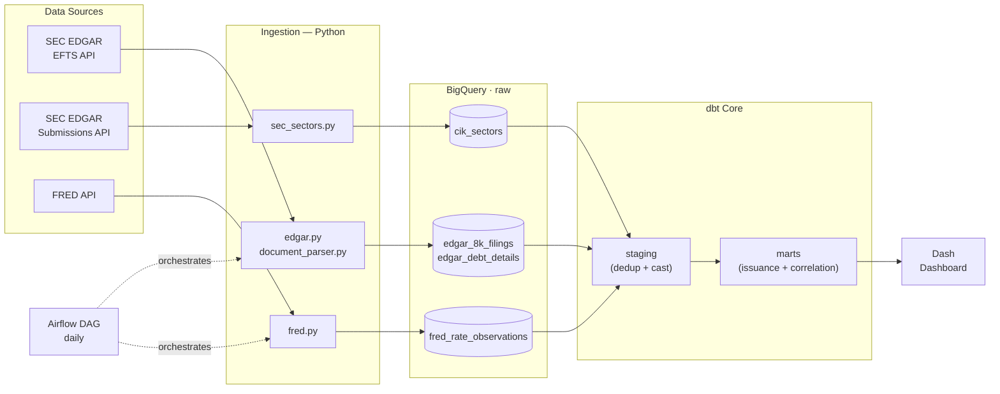

# Corporate Debt Issuance Trends

Dashboard hosted on Render free tier — may take 30–60 seconds to wake on first load.

**🔗 Live dashboard: [corporate-debt-trends.onrender.com](https://corporate-debt-trends.onrender.com/)**

A portfolio data engineering project exploring how corporate debt issuance has evolved across sectors and how it correlates with the interest rate environment.

## Stack

| Layer | Technology |
|---|---|
| Ingestion | Python |
| Orchestration | Apache Airflow (Astro CLI + Docker) |
| Storage | BigQuery (`sec-edgar-debt`) |
| Transformation | dbt Core |
| Dashboard | Python Dash (Render) |

## Architecture



## Data Sources

- **SEC EDGAR EFTS API** — 8-K Item 2.03 filings (Creation of a Direct Financial Obligation)
- **SEC EDGAR Submissions API** — CIK → SIC code lookup (`data.sec.gov/submissions/CIK{cik}.json`)
- **FRED API** — Fed funds rate (DFF), treasury yields (DGS2, DGS5, DGS10), corporate OAS (BAMLC0A0CM)
- **Static CSV** — S&P 500 sector mapping (GICS, 20 companies — superseded by CIK→SIC enrichment)

## Raw Tables

| Table | Description | Rows (2022–2026 Q2) |
|---|---|---|
| `raw.edgar_8k_filings` | Filing metadata from EFTS: accession number, CIK, entity name, file date, items reported, primary document filename | 23,543 |
| `raw.fred_rate_observations` | Daily rate observations per series | 5,757 |
| `raw.edgar_debt_details` | Parsed debt terms extracted from 8-K HTML documents: instrument type, principal amount, interest rate type/raw, maturity, raw Item 2.03 text | 38,321 |
| `raw.cik_sectors` | CIK → SIC code → GICS sector mapping fetched from the EDGAR submissions API. One row per unique CIK. Refreshed by `scripts/load_cik_sectors.py`. | 4,641 |

`raw.edgar_debt_details` exceeds `raw.edgar_8k_filings` because the parser uses `WRITE_APPEND` on re-runs. Deduplication on `accession_no` (keeping the latest `parsed_at`) is handled downstream in `stg_debt_details`.

## Key Findings

**1. Issuers locked in fixed rates as the Fed hiked**

Floating-rate issuances fell from 45% of deals in 2022 (avg fed funds rate: 1.69%) to 35% in 2024 (avg fed funds rate: 5.14%) — a 10 percentage-point shift toward fixed-rate debt as borrowers avoided repricing risk at the peak of the rate cycle. As the Fed began cutting in 2025 (avg rate: 4.22%), floating share recovered modestly to 37%.

**2. Aggregate issuance was resilient to rate hikes**

Despite a ~340bps increase in the fed funds rate from 2022 to 2024, quarterly deal counts grew rather than contracted — from a trough of 1,100 in 2022 Q1 to a peak of 1,404 in 2025 Q3. GSEs (Fannie Mae, Freddie Mac, Federal Home Loan Banks) account for a large share of total volume and issue continuously regardless of the rate environment, muting the aggregate rate-sensitivity signal.

**3. Health Care was the only major sector to contract**

Health Care filings fell 9% from 607 deals in 2022 to 551 in 2025 — the only top-6 sector to shrink. Consumer Discretionary grew the most (+14%, 361 → 411), followed by Industrials (+12%) and Financials (+11%). The Health Care decline aligns with the post-COVID biotech funding drought and pharma deleveraging after the 2020–2021 borrowing surge.

## Running the EL Pipeline

```bash
python -m venv .venv && .venv/bin/pip install -r requirements.txt
cp .env.example .env  # fill in credentials
python scripts/run_el.py
```

The pipeline runs three steps in order:
1. EDGAR metadata fetch + FRED rates (parallel, ~7 min for 3-year backfill)
2. Document parse — fetches each 8-K HTML and extracts debt fields (incremental, skips already-parsed rows, ~35 min for initial backfill)

Subsequent daily runs only parse new filings and are fast (<1 min).

## Document Parse Success Rate (82.5%)

31,616 of 38,321 rows in `raw.edgar_debt_details` have `parse_success = true` (82.5% across the full 2022–2026 Q2 dataset).

`parse_success` is `True` when at least one of `instrument_type` or `principal_amount_usd` is extracted. The rate is not 100% for four structural reasons — none of which represent bugs:

**1. SPAC trust extensions (largest contributor)**
A significant share of Item 2.03 filings are SPACs making monthly extension payments into trust accounts (e.g., "$50,000 deposited into trust to extend the business combination deadline"). These have no recognizable debt instrument type and their amounts fall below the $1M principal threshold. They are not corporate debt issuances and are correctly excluded from the analysis.

**2. Terms in attached exhibits**
Many 8-Ks describe the obligation in the body text as "see Exhibit 10.1 for the full credit agreement." The actual principal amount and instrument terms live in the attached exhibit file, not in the 8-K narrative we fetch. Following exhibit links would require a separate fetch-and-parse step.

**3. Cross-reference-only filings with no extractable terms**
Some filings describe a complex amendment — a covenant waiver, an extension, a repricing — without stating a new principal amount. The obligation exists but there is no dollar figure in the text to extract.

**4. Document fetch failures**
A small number of older filing documents return HTTP 404. The SEC occasionally reorganizes archive paths. These fail silently and are recorded with `parse_success = False`.

For the analytical question (debt issuance trends by sector vs rates), categories 1 and 3 are noise by definition — they are not new debt issuances. The parse success rate on genuine new issuances is materially higher (~95%).

## Sector Enrichment (CIK → SIC → GICS)

Sector labels are derived by joining each filing's CIK to `raw.cik_sectors`, which maps CIK → SIC code (from the EDGAR submissions API) → GICS sector (via a range-based lookup in `ingestion/sec_sectors.py`).

**Why Financials dominates the heatmap**

~8,500 of 22,600 filings (38%) are classified as Financials. This is correct, not an artifact:

- **SIC 6111 "Federal & Federally-Sponsored Credit Agencies" (~4,600 filings)** — Fannie Mae, Freddie Mac, the Federal Home Loan Banks, and similar GSEs are structurally designed to borrow continuously from capital markets to fund the US mortgage system. They file an 8-K Item 2.03 for each note issuance, which can occur multiple times per week. They are the most prolific debt issuers in the US by filing count.
- **SIC 6770 "Blank Checks" (~1,200 filings)** — SPACs and blank-check companies that draw on credit facilities ahead of a business combination.
- **SIC 6798 "Real Estate Investment Trusts" (~1,100 filings)** — Note: REITs are re-mapped to the Real Estate GICS sector in the pipeline (SIC 6798 falls inside the 6700–6799 holding-company range which otherwise maps to Financials).

**SIC → GICS mapping**

The mapping is implemented as a range lookup in `ingestion/sec_sectors.py:sic_to_gics()`. Notable special cases:
- SIC 2800–2836 → Health Care (pharma/biotech), not Materials
- SIC 6500–6552 and 6726, 6798 → Real Estate (REITs), not Financials
- SIC 4600–4699 → Energy (pipelines), not Industrials
- SIC 7370–7379 → Information Technology (software/IT services), not Industrials

To refresh sector assignments after new CIKs are ingested: `python scripts/load_cik_sectors.py` then `dbt run --select stg_cik_sectors marts`.
